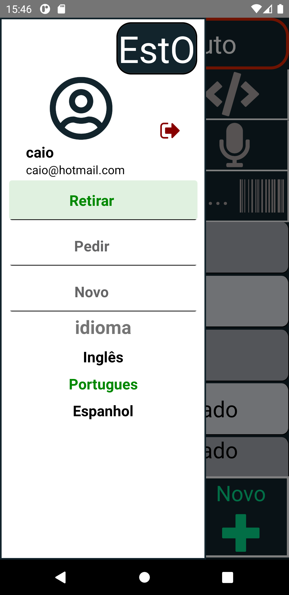

Projeto em React-native APP Android.

link DownLoad:https://1drv.ms/u/s!Ar9efMKmYjyciyTLBkly1I4fpB9B?e=fkChAy

    

Front-End:
React-Native

Bibliotecas/módulos:
Async-storage,
Masked-view,
React-navigation/drawer,
React-navigation/stack,
React-navigation/bottom-tabs,
axios,
expo-barcode-scanner,
i18n-js,
react-native-html-to-pdf-rd,
react-native-share,
react-native-view-shot,
react-native-vector-icons,

Back-End:
Nodejs

Bibliotecas/módulos:
bcrypt-nodejs,
body-parser,
consign,
cors,
dotenv,
express,
jwt-simple,
knex,
moment,
passport,
passport-jwt,
pg,

cloud:
DigitalOcean

Banco de dados:
Postgres

Docker:
Container/imagem

